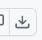

# Chata v Čifároch - Plná verzia zostrihané video komplet

> Pridaj sa k nám a pomôž nám otitulkovať video [>> návod nižšie tu <<](#návod-upraviť-titulky-videa)

Cieľom tohto projektu je vytvoriť jedno centrálne miesto na internete, kde budú pokope všetky zdroje ohľadom záznamov z konšpiračnej chaty v Čifároch v čo najprehľadnejšej forme. Vačšina ľudí nemá čas pozerať nezostrihaných 18 hodín záznamu bez tituliek, kde sú často  prázdne miesta alebo nezrozumiteľný zvuk. Toto chceme zmeniť, aby si ich široká verejnosť mohla čo najjednoducšie pozrieť.

**Momentálna taktika aktérov a ich poskokov je šíriť naratív "Veď tam aj tak nič také nie je". Neskočte na tieto reči, urobte si názor ako by klasik povedal "vlastnou hlavou"!**

Chceme tiež pomôcť novinárom sa v tom orientovať a mať pokope celý prepis, aby sa v ňom dalo ľahko vyhľadávať. Ďalej tento prepis chceme pripraviť aj do formy stráviteľnej pre ChatGPT, aby vedel odpovedať na otázky ohľadom obsahu videa.

Nakoniec chceme pripraviť aj krátke strihy (reels), aby si ich hocikto vedel stiahnuť a uploadnuť na TikTok, Facebook a iné socálne siete.

Nesmieme toto nechať zapadnúť prachom, treba pripomínať donekonečna ako klamali manipulovali! My síce nemáme peniaze, aby sme si mohli platiť trollov na Facebooku, ale pravda je na našej strane, a keď každý priloží ruku k dielu, dokážeme toho spraviť veľa a pretlačiť túto tému, nech stále neudávajú zástupné témy oni.

## Plán práce
Momentálne potrebujeme otitulkovať celé video, [>> návod nižšie tu <<](#návod-upraviť-titulky-videa)

- ✅ Zostrihať video do jedného videa (mp4 súboru), kde sú všetky videá chronologicky zoradené
- 🚧 Vystrihnúť alebo zrýchliť nezaujímavé časti videa, ideálne aby video malo max 10 hodín (momentálne má 11 hodín, ešte neviem či je možné skrátiť na 10 hodín)
- 🚧 Otitulkovanie celého videa
- ⛔ Pripraviť prepis titulkov do vyhľadávateľnej formy
- ⛔ Prepis titulkov do formy pre ChatGPT
- ⛔ Upload videa na Youtube. Pre tak dlhé videa treba verifikovaný účet tel. čislom, kľudne sa ozvite, kto ste ochotní to nahrať k sebe
- ⛔ Nastrihať videá do "reels" formátu
- ⛔ Preklad titulkov a ostatných textov do EN

✅ Hotovo - 🚧 Prebieha - ⛔ NezaÄaté

## Návod upraviť titulky videa

Momentálne je otitulkovaných iba prvých 10 minút videa a zvyšok videa sú automaticky generované titulky z Youtube čo určite pomôže. Ak chcete titulkovať tak:

1. Stiahnite video súbor [chata-v-cifaroch-full.mp4](path/to/chata-v-cifaroch-full.mp4) tak že sa naň prekliknete a vpravo hore kliknete na ikonku  šípky dole Äo je download raw file
2. Stiahnite súbor [chata-v-cifaroch-full.srt](path/to/chata-v-cifaroch-full.srt) tak že sa naň prekliknete a znovu pravo hore kliknete na ikonku šípky dole  Äo je download raw file
3. stiahnuté súbory otvorte u seba v počítači nejakom programe, ktorý dokáže editovať SRT titulky, napr. [SubtitleEdit](https://www.nikse.dk/subtitleedit), alebo iným, ktorý vám vyhovuje
4. editujte titulky. Dôležité je aby v nich bolo VŽDY celé meno hovoriaceho, napr. `Robert Fico: Niečo hovorí`. Ak je jeho reč na viacero screenov, tak už meno byť znovu nemusí, ale vždy ak začne hovoriť niekto iný tak treba VŽDY jeho CELÉ meno (toto bude velmi dôležité v budúcnosti pre generovanie zjednodušeného prepisu). Pozrite si prvých 10 minút tituliek ako to je tam.
5. uložte súbor a môžete urobiť PR srt súboru, co v praxi je [editácia titulkového súboru tu](https://github.com/dobrysamaritan/chata-v-cifaroch-plna-verzia-zostrihane-video-komplet/edit/main/chata-v-cifaroch-full.srt), alebo mi ten editovaný súbor pošlite na môj email [dobrysamaritan@proton.me](mailto:dobrysamaritan@proton.me) a ja tie zmeny publikujem. Budem sa snažiť publikovať vždy čo najskôr ako to pôjde.

Poprosím teraz pri začiatku si vybrať úplne náhodný úsek vo videu a ten titulkujte, aby sa nestalo, že 10 ľudí bude teraz prekladať tú istú časť videa. Neskôr, keď budem mať prehľad koľko ľudí na tom reálne má ochotu pracovať budem priraďovať úlohy jednotlivým ľuďom.

Ďaľšie tipy:
* VŽDY pred editáciou si stiahnite aktuálny .srt súbor!
* počúvajte so slúchatkami, ideálne s equalizérom, ktorý utlmuje bassy
* ak nerozumiete čo práve povedali, tak dajte do tituliek značku `(???)`
* časovanie nemusí byť dokonalé, na to je čas neskôr, priorita je mať celý prepis čo najskôr

## Klúčové slová

Robert Fico, Miroslav Bödör, Pavol Gašpar, Robert Kaliňák, Marek Para